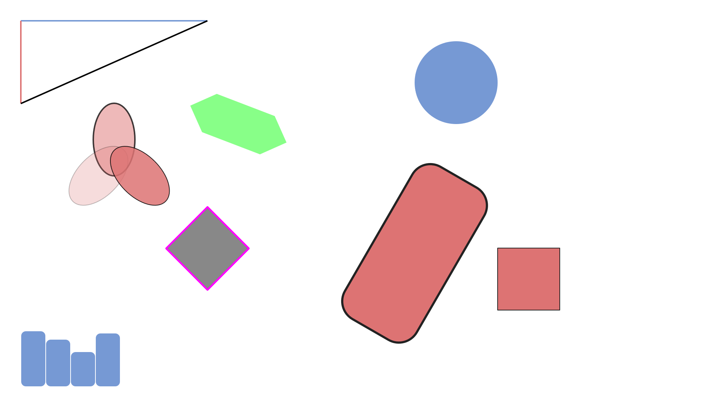
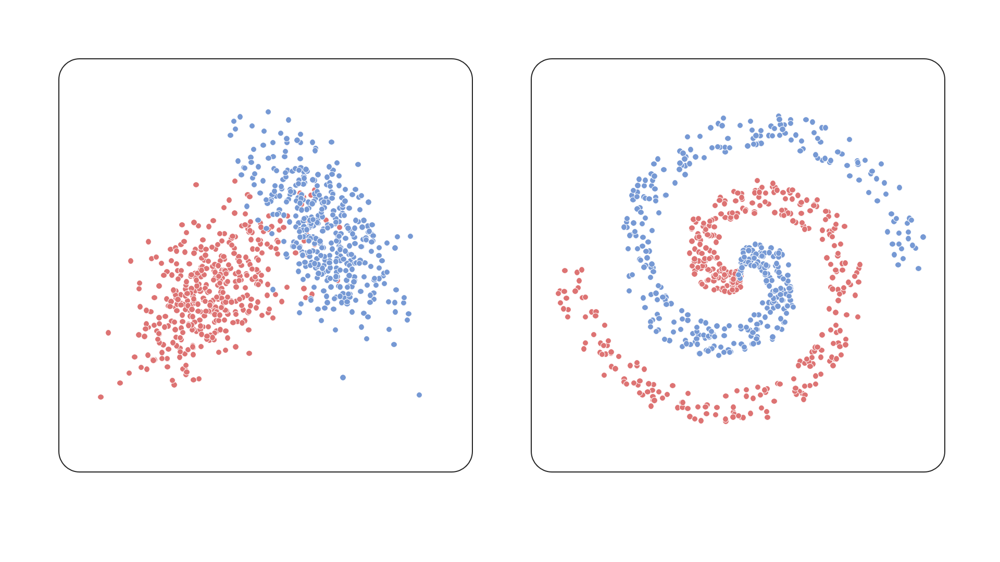
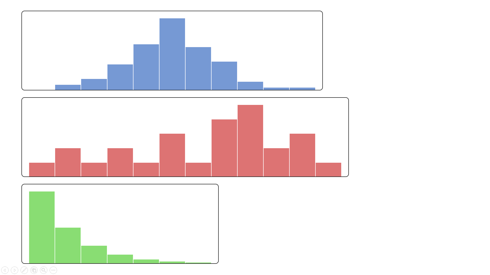
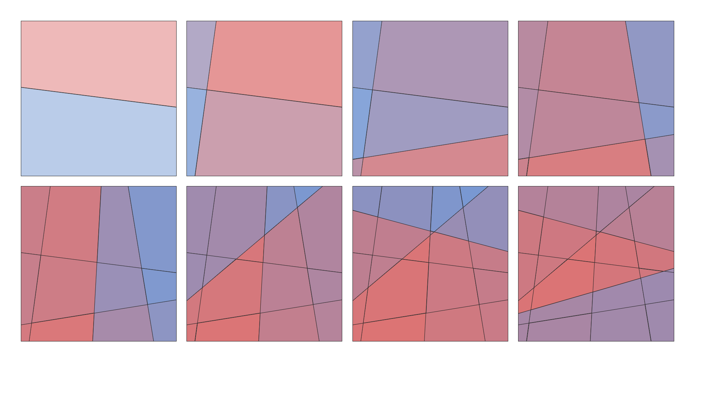
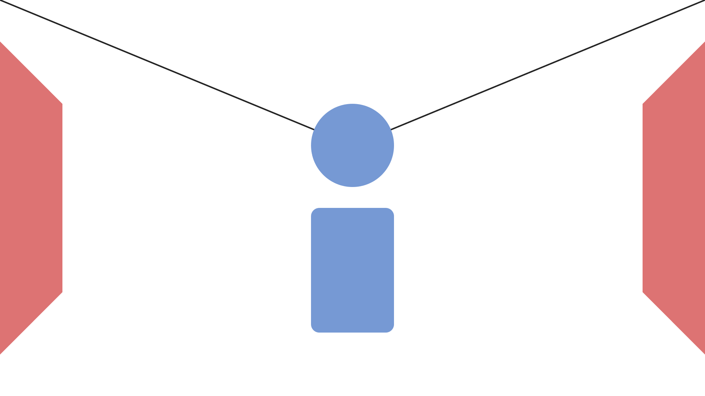
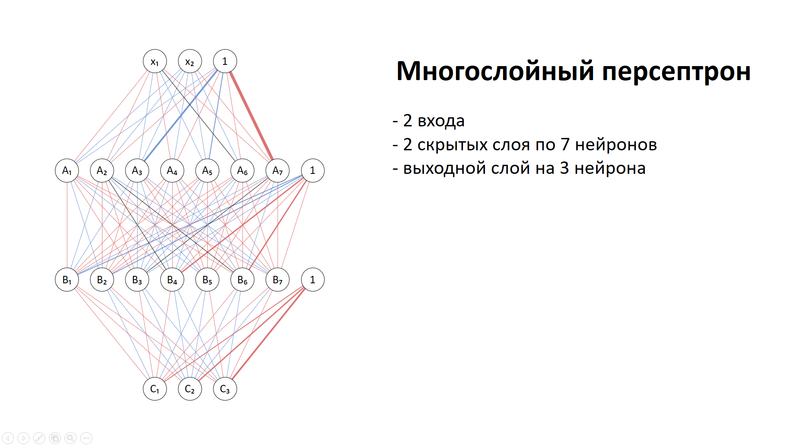

# PresentationGeometry

## Описание
Этот инструмент позволяет добавлять базовые геометрические фигуры на слайды PowerPoint (pptx).
Поддерживаются линии, эллипсы, прямоугольники (включая закругленные углы), полигоны и текстовые поля.
Работа осуществляется напрямую с XML-структурой файла pptx, что позволяет эффективно модифицировать содержимое презентации.

## Возможности
- Добавление линий, эллипсов, прямоугольников, полигонов и текстовых полей.
- Поддержка параметров заливки, обводки, толщины линий и прозрачности.
- Возможность группировки фигур одного типа.

## Установка
Для работы инструмента не требуются внешние зависимости.

## Пример использования
```python
import tempfile
from presentation import Presentation

with tempfile.TemporaryDirectory() as work_dir:
    presentation = Presentation(presentation_path="empty.pptx", work_path=work_dir)

    presentation.add_ellipse({"x": 20, "y": 2, "d": 4, "fill": "#7699d4"}, slide="slide1")
    presentation.add_rectangle({"x": 18, "y": 8, "w": 4, "h": 8.5, "radius": 0.25, "fill": "#dd7373", "stroke": "#222", "thickness": 3, "rotate": 30}, slide="slide2")
    presentation.add_line({"x1": 1, "y1": 1, "x2": 10, "y2": 1, "thickness": 2, "stroke": "#7699d4"}, slide="slide2")

    presentation.save("result.pptx")
```

## Параметры фигур
### Линия
- `x1`, `y1` – начальная координата;
- `x2`, `y2` – конечная координата;
- `stroke` – цвет линии;
- `stroke-opacity` – непрозрачность обводки;
- `stroke-dash` – штрихи (одно из значений: `solid`, `dashed`, `dotted`, `short-dashed`, `dash-dotted`, `long-dashed`, `long-dash-dotted`, `long-dash-dot-dotted`);
- `thickness` – толщина обводки.

#### Пример:

```python
{
    "x1": 1,
    "y1": 1,
    "x2": 10,
    "y2": 1,
    "stroke": "#7699d4",
    "stroke-opacity": 0.8,
    "stroke-dash": "solid",
    "thickness": 2
}
```

### Эллипс
- `x`, `y` – координата левого верхнего угла;
- `dx` – горизонтальный диаметр;
- `dy` – вертикальный диаметр;
- `d` – диаметр (для окружности);
- `rotate` – угол поворота (в градусах);
- `fill` – цвет заливки;
- `fill-opacity` – непрозрачность заливки;
- `stroke` – цвет обводки;
- `stroke-opacity` – непрозрачность обводки;
- `stroke-dash` – штрихи;
- `thickness` – толщина обводки.

#### Пример

```python
{
    "x": 20,
    "y": 2,
    "dx": 4,
    "dy": 6,
    "rotate": 15,
    "fill": "#7699d4",
    "fill-opacity": 0.6,
    "stroke": "#222",
    "stroke-opacity": 0.8,
    "thickness": 2
}
```

### Прямоугольник
- `x`, `y` – координата левого верхнего угла;
- `w`, `h` – ширина и высота;
- `radius` – процент скругления углов (от 0 до 1);
- `rotate` – угол поворота (в градусах);
- `fill` – цвет заливки;
- `fill-opacity` – непрозрачность заливки;
- `stroke` – цвет обводки;
- `stroke-opacity` – непрозрачность обводки;
- `stroke-dash` – штрихи;
- `thickness` – толщина обводки.

#### Пример:

```python
{
    "x": 18,
    "y": 8,
    "w": 4,
    "h": 8.5,
    "radius": 0.25,
    "rotate": 30,
    "fill": "#dd7373",
    "fill-opacity": 0.7,
    "stroke": "#222",
    "stroke-opacity": 0.9,
    "thickness": 3
}
```

### Полигон
- `points` – список координат точек (словарь вида `{"x": float, "y": float}`);
- `rotate` – угол поворота (в градусах);
- `fill` – цвет заливки;
- `fill-opacity` – непрозрачность заливки;
- `stroke` – цвет обводки;
- `stroke-opacity` – непрозрачность обводки;
- `stroke-dash` – штрихи;
- `thickness` – толщина обводки.

#### Пример:

```python
{
    "points": [
        {"x": 1, "y": 1},
        {"x": 4, "y": 5},
        {"x": 7, "y": 2}
    ],
    "rotate": 10,
    "fill": "#ffcc00",
    "fill-opacity": 0.5,
    "stroke": "#333",
    "stroke-opacity": 0.8,
    "thickness": 2
}
```

### Текстовое поле
- `x`, `y` – координата левого верхнего угла;
- `w`, `h` – ширина и высота;
- `text` – текстовое содержимое:
- `size` – размер шрифта;
- `align` – горизонтальное выравнивание (одно из значений: `left`, `center`, `right`);
- `vertical-align` – вертикальное выравнивание (одно из значений: `top`, `center`, `bottom`);
- `margin` – поля (словарь вида `{"left": float, "right": float, "top": float, "bottom": float}`);
- `auto-fit` – автоматическая подстройка высоты поля (`True` / `False`);
- `rotate` – угол поворота (в градусах);
- `color` – цвет текста;
- `bold` – жирный текст (`True` / `False`);
- `italic` – курсивный текст (`True` / `False`);
- `underline` – подчёркнутый текст (`True` / `False`);
- `strike` – зачёркнутый текст (`True` / `False`);
- `fill` – цвет заливки;
- `fill-opacity` – непрозрачность заливки;
- `stroke` – цвет обводки;
- `stroke-opacity` – непрозрачность обводки;
- `stroke-dash` – штрихи;
- `thickness` – толщина обводки.

#### Пример:

```python
{
    "x": 5,
    "y": 7,
    "w": 9,
    "h": 4,
    "text": "Hello, world!\nHow are you?",
    "size": 25,
    "align": "right",
    "vertical-align": "bottom",
    "margin": {"left": 0.5, "right": 0.5, "top": 1, "bottom": 0.25},
    "auto-fit": False,
    "rotate": 45,
    "color": "#00ff00",
    "stroke": "#ff0000",
    "stroke-opacity": 0.5,
    "fill": "#0000ff",
    "fill-opacity": 0.2,
    "thickness": 4
}
```

## Методы добавления фигур

### Добавление одной фигуры
- `add_line(line: dict)` – добавление линии;
- `add_ellipse(ellipse: dict)` – добавление эллипса;
- `add_rectangle(rectangle: dict)` – добавление прямоугольника;
- `add_polygon(polygon: dict)` – добавление полигона;
- `add_textbox(textbod: dict)` – добавление текстового поля;
- `add_shape(shape: dict)` – добавление фигуры (должен содержаться ключ `shape` с одним из значений `line`, `ellipse`, `rectangle` или `polygon`).

### Добавление нескольких фигур (с объединением в группу)
- `add_lines(lines: List[dict])` – добавление линий;
- `add_ellipses(ellipses: List[dict])` – добавление эллипсов;
- `add_rectangles(rectangles: List[dict])` – добавление прямоугольников;
- `add_polygons(polygons: List[dict])` – добавление полигонов;
- `add_textboxes(textboxes: List[dict])` – добавление текстовых полей;
- `add_shapes(shapes: List[dict])` – добавление фигур.

## Как это работает
1. Используется заранее подготовленный файл `empty.pptx` с десятью пустыми слайдами.
2. Презентация распаковывается во временную директорию (pptx – это всего-лишь zip-архив).
3. Внесение изменений происходит в файлах `ppt/slides/slide<number>.xml` (для работы необходимо указывать слайд без расширения, например, `slide1`).
4. После внесения изменений всё запаковывается обратно в pptx-файл.

## Примеры

Примеры использования можно найти в папке `examples`

### Пример 1. Базовые фигуры

Код примера находится в файле [examples/basic.py](examples/basic.py)



Скачать пример презентации: [examples/basic.pptx](examples/basic.pptx)


### Пример 2. Визуализация распределений

Код примера находится в файле [examples/scatter.py](examples/scatter.py)



Скачать пример презентации: [examples/scatter.pptx](examples/scatter.pptx)


### Пример 3. Гистограммы

Код примера находится в файле [examples/histogram.py](examples/histogram.py)



Скачать пример презентации: [examples/histogram.pptx](examples/histogram.pptx)


### Пример 4. Полигоны

Код примера находится в файле [examples/polygons.py](examples/polygons.py)



Скачать пример презентации: [examples/polygons.pptx](examples/polygons.pptx)


### Пример 4. Фигуры

Код примера находится в файле [examples/shapes.py](examples/shapes.py)



Скачать пример презентации: [examples/shapes.pptx](examples/shapes.pptx)


### Пример 5. Нейросеть

Код примера находится в файле [examples/neural_network.py](examples/neural_network.py)



Скачать пример презентации: [examples/neural_network.pptx](examples/neural_network.pptx)


## Лицензия
MIT License
